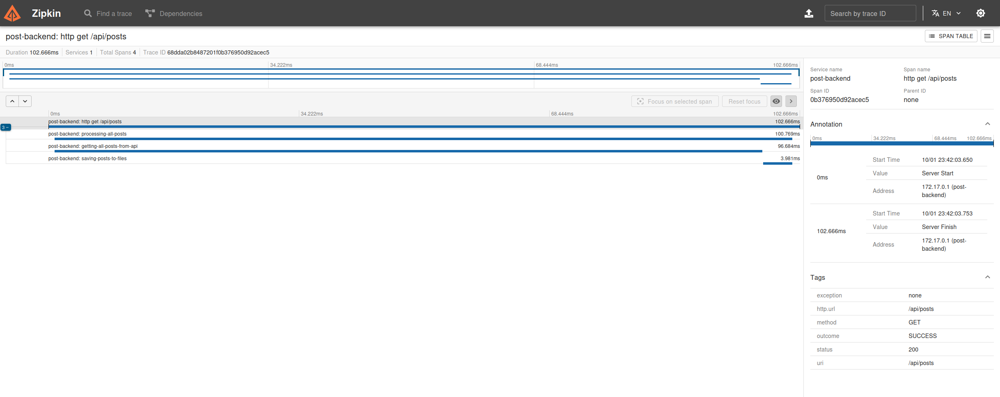

# Post Application

This application is a tool for retrieving latest posts from external API.
It was developed using Spring Boot 3.5, Java SDK version 21.

### Prerequisites

You need to have Java 21 and Maven installed on your machine. For Zipkin running and having UI to follow tracking infos run service using attached docker-compose.yml or simply run docker command:
`docker run -d -p 9411:9411 openzipkin/zipkin`

### Usage

1. GET /api/posts: This endpoint returns all recent posts.
   `curl -X GET 'http://localhost:8080/api/posts'`
2. Metrics for Circuit Breaker: `curl -X GET 'http://localhost:8080/actuator/circuitbreakers'`

3. Zipkin UI: This service allows you to track recent requests and its details as: duration, starting time and spans. Gives possibility to analyze bottlenecks and issues.
 `http://localhost:9411/zipkin/`

### Zipkin example trace for GET /api/posts
